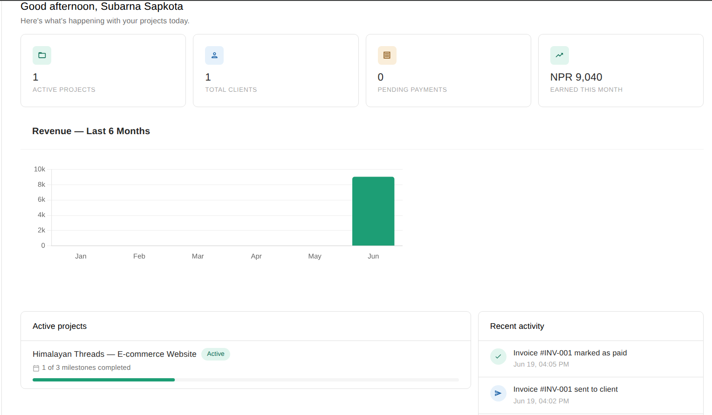
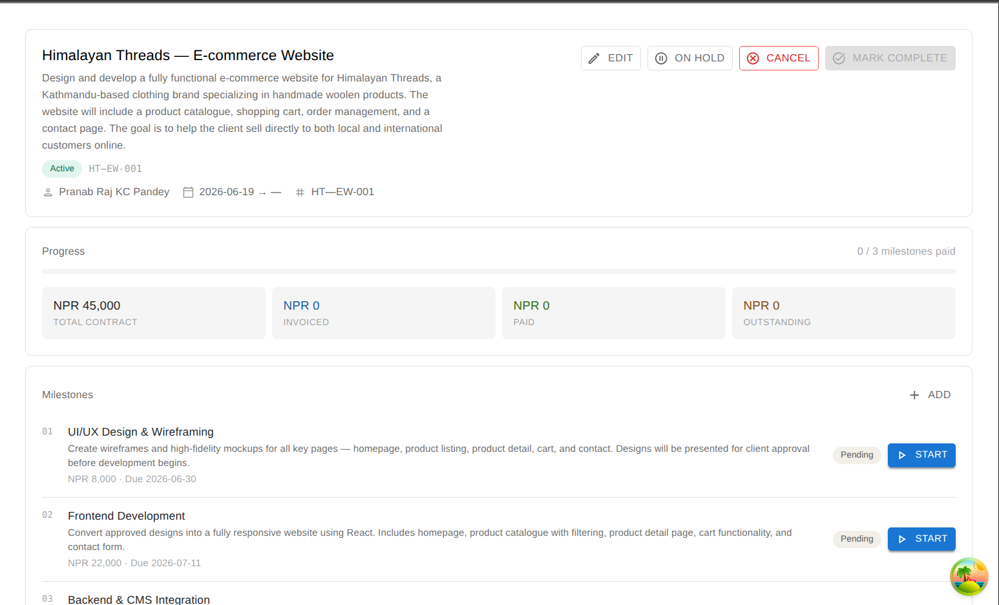
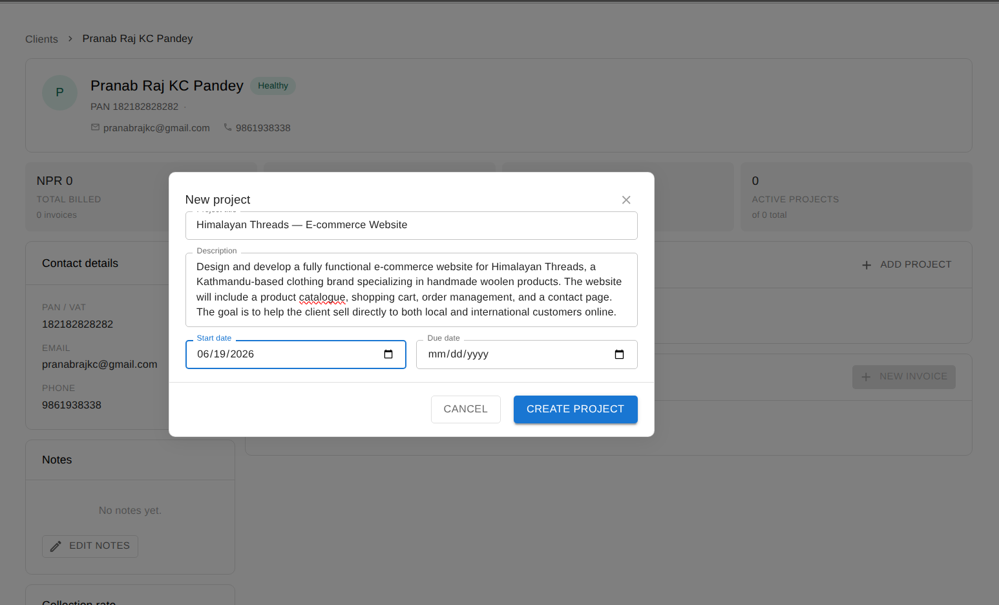
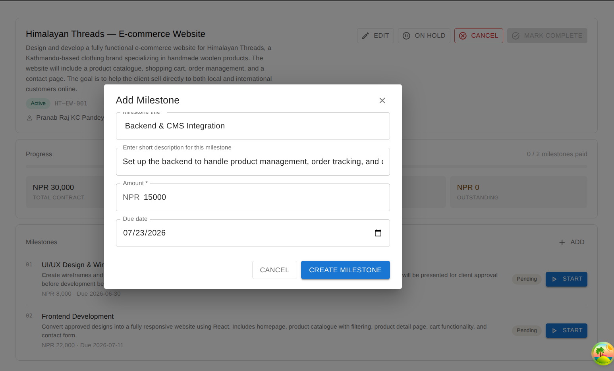
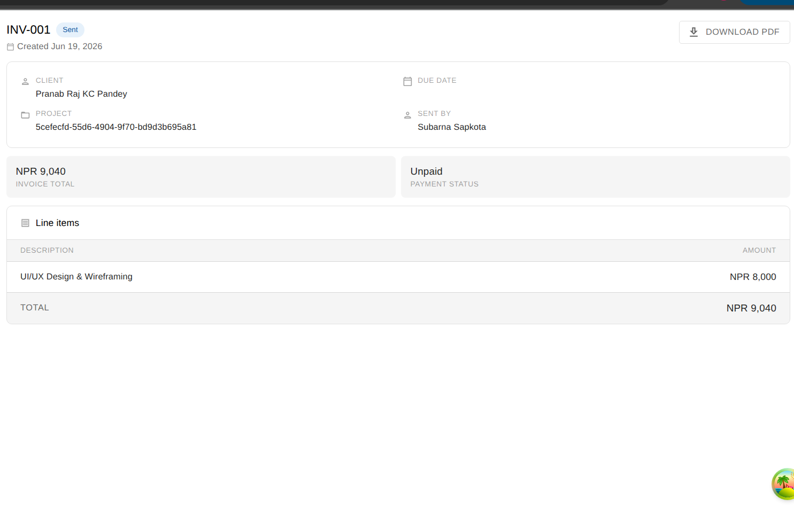
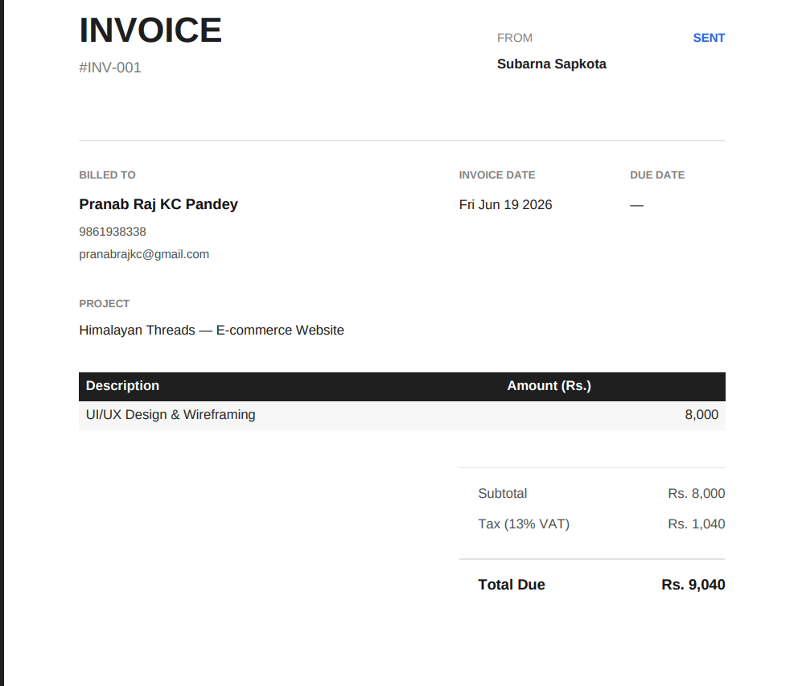
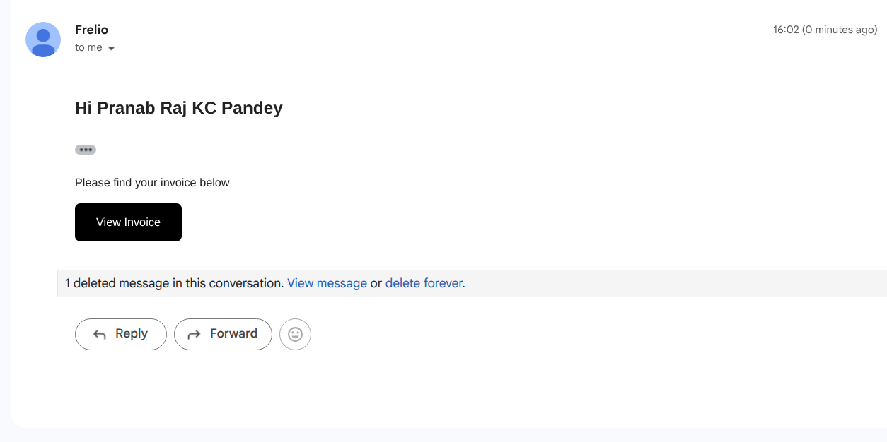
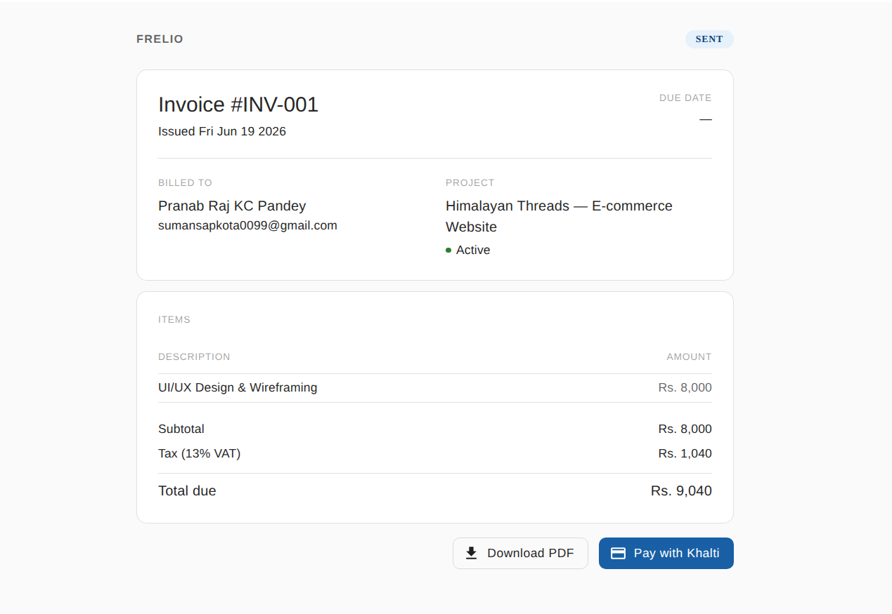

# Frelio

**Freelance management built for Nepali freelancers and small agencies.**

Frelio helps you manage clients, projects, milestones, and invoices — all in one place. Send invoices via email, let clients pay through Khalti, and track your revenue from a single dashboard.

🔗 **Live Demo:** [frelio.vercel.app](https://frelio.vercel.app)

---

## Table of Contents

- [Features](#features)
- [Tech Stack](#tech-stack)
- [Screenshots](#screenshots)
- [Getting Started](#getting-started)
  - [Prerequisites](#prerequisites)
  - [Installation](#installation)
  - [Environment Variables](#environment-variables)
  - [Supabase Setup](#supabase-setup)
- [Workflow](#workflow)
- [License](#license)

---

## Features

**Dashboard**
- Summary metrics: total clients, active projects, invoices sent, revenue earned
- Revenue chart broken down by month
- Activity feed showing recent invoice events (created, sent, paid)
- Upcoming project deadlines at a glance

**Clients**
- Add and manage clients with contact details (email, phone, address, PAN)
- Client detail view with linked projects, invoice history, and total billed amount
- Inline editing of client contact information

**Projects & Milestones**
- Create projects linked to a client with start/due dates
- Auto-generated project codes
- Milestone-based billing — each milestone has its own title, amount, due date, and status
- Project status management: active → on hold → completed / cancelled
- Milestone progress tracked with a visual progress bar

**Invoices**
- Generate invoices directly from completed milestones
- Full status lifecycle: `draft → sent → viewed → paid` (or `overdue`, `partially paid`, `cancelled`)
- Sender and client details are snapshotted at the time of invoice creation
- Download invoice as a PDF
- Send invoice to the client via email (Supabase Edge Function)

**Client Portal**
- Every invoice has a unique, shareable public link — no login required for the client
- Clients can view the full invoice, line items, tax, and total
- Clients can pay directly via **Khalti**

**Settings**
- Update your profile: name, phone number, business name, PAN number
- This information is used on all your invoices
- Change your password

---

## Tech Stack

| Category | Technology |
|---|---|
| Frontend | React 19, TypeScript, Vite |
| UI Library | MUI (Material UI v9) |
| Backend | Supabase (PostgreSQL, Auth, Edge Functions) |
| Server State | TanStack Query v5 |
| Client State | Zustand v5 |
| Forms | React Hook Form v7 + Zod |
| Routing | React Router v7 |
| PDF Generation | jsPDF + jspdf-autotable |
| Charts | Chart.js + react-chartjs-2 |
| Payments | Khalti |
| Notifications | react-hot-toast |
| Date Handling | Day.js |

---

## Screenshots


**Dashboard**


**Projects**



**Milestone**


**Invoice Detail**



**PDF Generation**


**Send invoice to client through mail**


**Client Portal**


---

## Getting Started

### Prerequisites

Make sure you have the following installed:

- [Node.js](https://nodejs.org/) v18 or higher
- [npm](https://npmjs.com/) or your preferred package manager
- A [Supabase](https://supabase.com/) account (free tier works)
- A [Khalti](https://khalti.com/) merchant account (for payments)

---

### Installation

```bash
# 1. Clone the repository
git clone https://github.com/subarna0077/Frelio.git
cd Frelio

# 2. Install dependencies
npm install

# 3. Set up your environment variables (see below)
cp .env.example .env

# 4. Start the development server
npm run dev
```

The app will be running at `http://localhost:5173`.

---

### Environment Variables

Create a `.env` file in the root of the project and add the following:

```env
VITE_SUPABASE_URL=your_supabase_project_url
VITE_SUPABASE_ANON_KEY=your_supabase_anon_key
```

You can find both values in your Supabase project under **Settings → API**.

---

### Supabase Setup

#### 1. Database Tables

Run the following table schemas in the **Supabase SQL Editor** in this order:

<details>
<summary><strong>profiles</strong></summary>

```sql
create table profiles (
  id uuid primary key references auth.users(id) on delete cascade,
  full_name text,
  email text,
  phone text,
  business_name text,
  pan_number text,
  created_at timestamptz default now()
);
```
</details>

<details>
<summary><strong>clients</strong></summary>

```sql
create table clients (
  id uuid primary key default gen_random_uuid(),
  user_id uuid references auth.users(id) on delete cascade not null,
  name text not null,
  email text,
  phone text,
  address text,
  pan_number text,
  created_at timestamptz default now()
);
```
</details>

<details>
<summary><strong>projects</strong></summary>

```sql
create table projects (
  id uuid primary key default gen_random_uuid(),
  user_id uuid references auth.users(id) on delete cascade not null,
  client_id uuid references clients(id) on delete cascade not null,
  title text not null,
  description text,
  project_code text,
  status text default 'active' check (status in ('active', 'on_hold', 'completed', 'cancelled')),
  start_date date,
  due_date date,
  completed_at timestamptz,
  created_at timestamptz default now()
);
```
</details>

<details>
<summary><strong>milestones</strong></summary>

```sql
create table milestones (
  id uuid primary key default gen_random_uuid(),
  project_id uuid references projects(id) on delete cascade not null,
  user_id uuid references auth.users(id) on delete cascade not null,
  title text not null,
  description text,
  amount numeric not null default 0,
  status text default 'pending' check (status in ('pending', 'in_progress', 'completed', 'invoiced', 'paid', 'cancelled')),
  due_date date,
  completed_at timestamptz,
  order_index int,
  invoice_id uuid,
  created_at timestamptz default now()
);
```
</details>

<details>
<summary><strong>invoices</strong></summary>

```sql
create table invoices (
  id uuid primary key default gen_random_uuid(),
  user_id uuid references auth.users(id) on delete cascade not null,
  client_id uuid references clients(id) not null,
  project_id uuid references projects(id) not null,
  milestone_id uuid references milestones(id),
  invoice_number text not null,
  status text default 'draft' check (status in ('draft', 'sent', 'viewed', 'paid', 'overdue', 'partially_paid', 'cancelled')),
  due_date date,
  notes text,
  subtotal numeric,
  tax numeric,
  total numeric,
  amount_paid numeric,
  amount_due numeric,
  public_token uuid default gen_random_uuid(),
  sender_snapshot jsonb,
  client_snapshot jsonb,
  payment_method text check (payment_method in ('khalti', 'esewa', 'bank', 'cash')),
  payment_reference text,
  sent_at timestamptz,
  viewed_at timestamptz,
  paid_at timestamptz,
  created_at timestamptz default now()
);
```
</details>

<details>
<summary><strong>invoice_items</strong></summary>

```sql
create table invoice_items (
  id uuid primary key default gen_random_uuid(),
  invoice_id uuid references invoices(id) on delete cascade not null,
  description text not null,
  amount numeric not null
);
```
</details>

#### 2. Row Level Security (RLS)

Enable RLS on all tables and add a policy so users can only access their own data. Example for the `projects` table — repeat this pattern for all tables:

```sql
alter table projects enable row level security;

create policy "Users can manage their own projects"
  on projects
  for all
  using (auth.uid() = user_id);
```

For the `invoices` table, the client portal also needs public read access via the `public_token`:

```sql
create policy "Public can view invoice by token"
  on invoices
  for select
  using (true);
```

#### 3. Auth Trigger (auto-create profile)

This trigger automatically creates a profile row when a new user signs up:

```sql
create or replace function public.handle_new_user()
returns trigger as $$
begin
  insert into public.profiles (id, full_name, email)
  values (new.id, new.raw_user_meta_data->>'full_name', new.email);
  return new;
end;
$$ language plpgsql security definer;

create trigger on_auth_user_created
  after insert on auth.users
  for each row execute procedure public.handle_new_user();
```

#### 4. Edge Function — send-invoice-email

Frelio uses a Supabase Edge Function to send invoice emails to clients.

Install the [Supabase CLI](https://supabase.com/docs/guides/cli) and deploy the function:

```bash
supabase functions deploy send-invoice-email
```

Set the required secrets in your Supabase project (**Settings → Edge Functions → Secrets**):

```
RESEND_API_KEY=your_resend_api_key
KHALTI_SECRET_KEY=your_khalti_secret_key
```

> Frelio uses [Resend](https://resend.com) for email delivery. Sign up for a free account and grab your API key.

---

## Workflow

Here is the typical flow from a new client to a paid invoice:

```
1. Add a Client
   └─ Go to Clients → Add client with name, email, and contact details

2. Create a Project
   └─ Go to Projects → Add project → link it to the client

3. Add Milestones
   └─ Open the project → Add milestones with titles and amounts
      (e.g. "UI Design — NPR 15,000", "Backend Integration — NPR 25,000")

4. Complete a Milestone
   └─ Mark the milestone as Completed when the work is done

5. Generate an Invoice
   └─ From the milestone, click "Create Invoice"
      The invoice is pre-filled with the milestone amount and client details

6. Send the Invoice
   └─ Go to Invoices → Send → the client receives an email with a portal link

7. Client Pays
   └─ The client opens their portal link, reviews the invoice, and pays via Khalti

8. Track Revenue
   └─ Dashboard updates automatically with paid amounts and activity
```

---

## License

This project is open source and available under the [MIT License](./LICENSE).