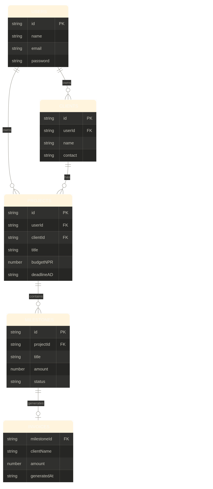
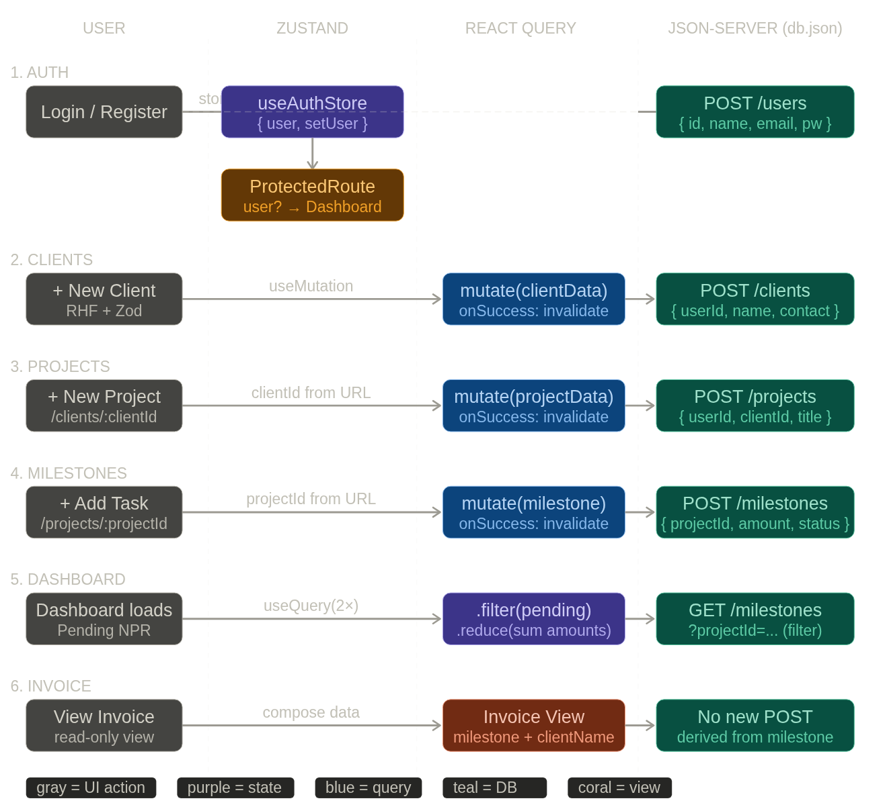
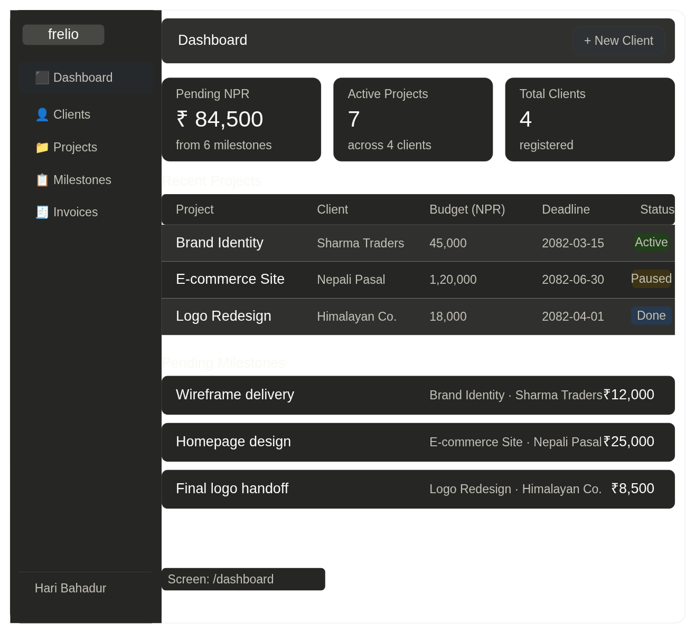
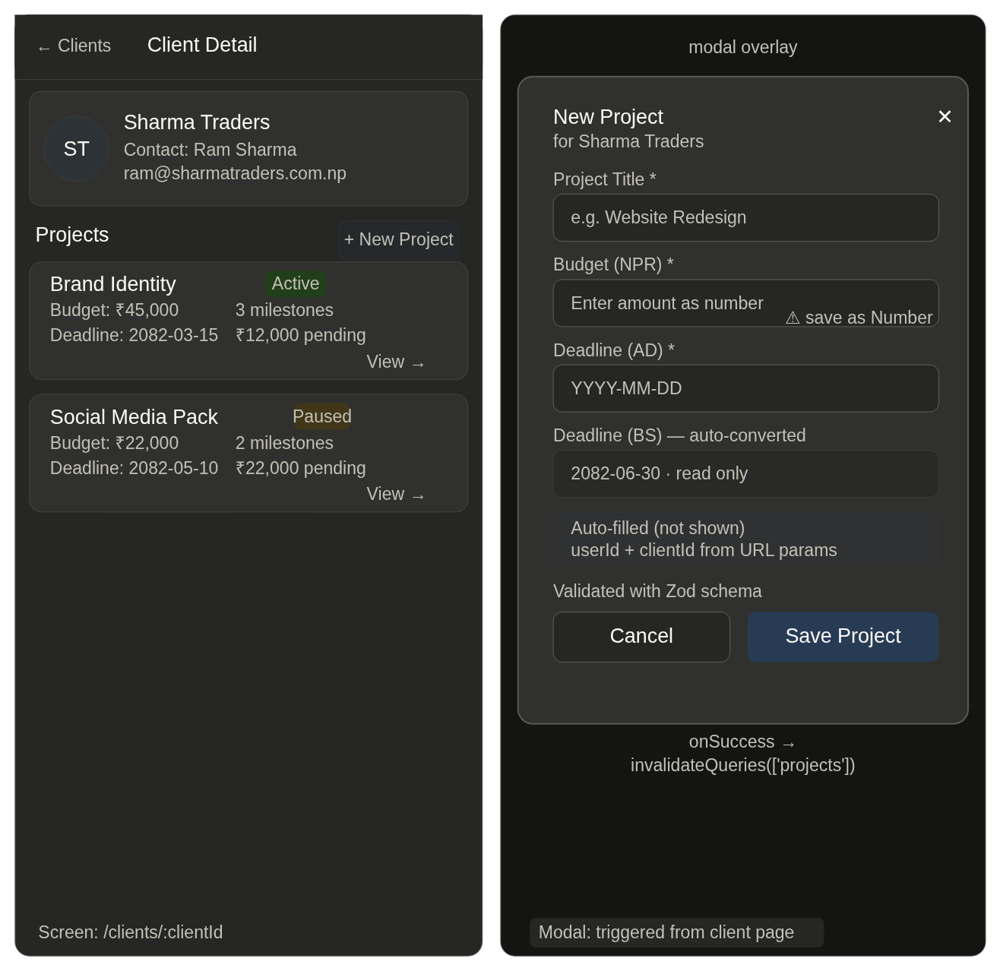

# Frelio — Phase 1: Core MVP

> **Frelio** is a freelance project management SaaS built for Nepali clients.
> Phase 1 establishes the full data tree: User → Client → Project → Milestone → Invoice View.

---

## Table of Contents

1. [Phase 1 Goal](#1-phase-1-goal)
2. [Tech Stack](#2-tech-stack)
3. [Success Metrics (Definition of Done)](#3-success-metrics-definition-of-done)
4. [Route Map](#4-route-map)
5. [Data Model (Entity Relationship)](#5-data-model-entity-relationship)
6. [State Management Strategy](#6-state-management-strategy)
7. [Authentication & Security Flow](#7-authentication--security-flow)
8. [Data Flow — Full Lifecycle](#8-data-flow--full-lifecycle)
9. [Dashboard Aggregation Logic](#9-dashboard-aggregation-logic)
10. [Wireframes](#10-wireframes)
11. [Component Checklist](#11-component-checklist)
12. [Known Constraints & Gotchas](#12-known-constraints--gotchas)

---

## 1. Phase 1 Goal

Build a working MVP where a freelancer can:

- Register and log in (persisted session)
- Create and manage **Clients**
- Create **Projects** tied to a specific Client with a budget in NPR and an AD deadline
- Add **Milestones** (tasks) to a Project with individual amounts and statuses
- View a **Dashboard** showing total pending NPR across all milestones
- Generate an **Invoice View** from any Milestone — no extra DB write needed

The backend is a **mock REST API** powered by `json-server` with a `db.json` file. No real backend in Phase 1.

---

## 2. Tech Stack

| Layer | Tool | Reason |
|---|---|---|
| Framework | React + Vite | Fast dev setup |
| Routing | React Router v6 | Nested routes, URL params |
| Global State | Zustand (persisted) | Auth user stored globally |
| Server State | React Query (TanStack) | Caching, loading states, auto-refresh |
| Forms | React Hook Form + Zod | Performance + schema validation |
| Mock Backend | json-server | REST API from `db.json` |
| Date Handling | `bikram-sambat` or `nepali-date-converter` | AD ↔ BS conversion |
| Styling | Tailwind CSS | Utility-first, fast iteration |

---

## 3. Success Metrics (Definition of Done)

Phase 1 is complete when **all five** of these pass:

- [ ] Refresh the page → stay logged in (Zustand with `persist` middleware)
- [ ] Log in as User B → cannot see User A's clients or projects (userId filtering on all queries)
- [ ] Delete a Project → its associated Milestones are removed from the UI (cascade delete or React Query invalidation)
- [ ] The `budgetNPR` field in the Project form saves as a **Number** in `db.json`, not a String
- [ ] Dashboard shows correct **Pending NPR** sum (calculated via `.filter()` + `.reduce()` on milestone data)

---

## 4. Route Map

```
/                       → redirect to /dashboard (if logged in) or /login
/login                  → Login page
/register               → Register page

/dashboard              → Dashboard (Protected)
/clients                → All clients for logged-in user (Protected)
/clients/:clientId      → Single client detail + their projects (Protected)
/clients/:clientId/projects/:projectId   → Project detail + milestones (Protected)
/clients/:clientId/projects/:projectId/invoice/:milestoneId  → Invoice view (Protected)
```

**Protected Route logic:**

```jsx
// components/ProtectedRoute.jsx
const ProtectedRoute = ({ children }) => {
  const user = useAuthStore((s) => s.user);
  if (!user) return <Navigate to="/login" replace />;
  return children;
};
```

---

## 5. Data Model (Entity Relationship)

> See diagram: `docs/images/frelio-erd.png`



### `db.json` schema

```json
{
  "users": [
    { "id": "u1", "name": "Hari Bahadur", "email": "hari@frelio.app", "password": "hashed" }
  ],
  "clients": [
    { "id": "c1", "userId": "u1", "name": "Sharma Traders", "contact": "ram@sharmatraders.com.np" }
  ],
  "projects": [
    {
      "id": "p1",
      "userId": "u1",
      "clientId": "c1",
      "title": "Brand Identity",
      "budgetNPR": 45000,
      "deadlineAD": "2025-09-30"
    }
  ],
  "milestones": [
    {
      "id": "m1",
      "projectId": "p1",
      "title": "Wireframe delivery",
      "amount": 12000,
      "status": "pending"
    }
  ]
}
```

**Key rule:** `budgetNPR` and `amount` must always be stored as **Numbers**. Use `Number(formValues.budgetNPR)` before POST. Zod: `z.coerce.number()`.

### Relationship Summary

| Parent | Child | FK on Child | Cardinality |
|---|---|---|---|
| User | Client | `userId` | 1 → many |
| User | Project | `userId` | 1 → many |
| Client | Project | `clientId` | 1 → many |
| Project | Milestone | `projectId` | 1 → many |
| Milestone | Invoice | *(derived, no FK)* | 1 → view |

---

## 6. State Management Strategy

| Scenario | Tool | Why |
|---|---|---|
| Logged-in user info | **Zustand** + `persist` | Needed globally across all pages and headers; survives page refresh |
| List of clients / projects | **React Query** | Handles caching, loading states, and automatic re-fetching |
| Active client ID | **URL params** (`:clientId`) | Allows users to bookmark a specific client's page |
| Active project ID | **URL params** (`:projectId`) | Same reason |
| Form inputs | **React Hook Form** | Best performance; validation with Zod |
| Pending NPR total | **Derived in component** | `.filter()` + `.reduce()` on React Query data; no separate state |

### Zustand store

```js
// stores/authStore.js
import { create } from 'zustand';
import { persist } from 'zustand/middleware';

export const useAuthStore = create(
  persist(
    (set) => ({
      user: null,
      setUser: (user) => set({ user }),
      logout: () => set({ user: null }),
    }),
    { name: 'frelio-auth' } // key in localStorage
  )
);
```

---

## 7. Authentication & Security Flow

> See diagram: `docs/images/frelio-data-flow.png`



### Registration

```
POST /users  →  { id, name, email, password }
On success   →  setUser(response) in Zustand  →  navigate('/dashboard')
```

### Login

```
GET /users?email=...&password=...
If user found  →  setUser(response[0]) in Zustand  →  navigate('/dashboard')
If not found   →  show error "Invalid credentials"
```

> **Note:** Password hashing is out of scope for Phase 1 (mock backend). Add bcrypt in Phase 2 when a real backend is introduced.

### User isolation

Every query to `/clients`, `/projects`, and `/milestones` must filter by `userId`:

```js
// Correct — always scope to logged-in user
GET /clients?userId=u1
GET /projects?userId=u1&clientId=c1
```

Never fetch all records and filter client-side — this is both insecure and slow.

---

## 8. Data Flow — Full Lifecycle

> See diagram: `docs/images/frelio-data-flow.png`

### A. Create Client

```
User fills form (name, contact)
  → React Hook Form validates with Zod
  → useMutation: POST /clients { userId: currentUser.id, ...formValues }
  → onSuccess: queryClient.invalidateQueries(['clients'])
  → Client appears in list without manual refresh
```

### B. Create Project

```
User is on /clients/:clientId
  → clientId pulled from useParams()
  → userId pulled from Zustand
  → useMutation: POST /projects { userId, clientId, title, budgetNPR: Number(v), deadlineAD }
  → onSuccess: queryClient.invalidateQueries(['projects', clientId])
```

### C. Create Milestone

```
User is on /clients/:clientId/projects/:projectId
  → projectId pulled from useParams()
  → useMutation: POST /milestones { projectId, title, amount: Number(v), status: 'pending' }
  → onSuccess: queryClient.invalidateQueries(['milestones', projectId])
```

### D. Delete Project (cascade UI)

```
User clicks "Delete Project"
  → First: DELETE /milestones for each milestone where projectId matches
    (json-server has no cascade; must delete children manually before parent)
  → Then: DELETE /projects/:id
  → onSuccess: invalidate both ['projects'] and ['milestones']
```

### E. Invoice View (read-only, no POST)

```
User opens /invoice/:milestoneId
  → useQuery: GET /milestones/:milestoneId
  → useQuery: GET /projects/:projectId  (from milestone.projectId)
  → useQuery: GET /clients/:clientId    (from project.clientId)
  → Compose: clientName + projectTitle + milestone amount + date
  → Render as printable invoice layout
```

---

## 9. Dashboard Aggregation Logic

```js
// hooks/usePendingNPR.js
const { data: projects } = useQuery(['projects'], () =>
  fetch(`/projects?userId=${user.id}`).then(r => r.json())
);

const projectIds = projects?.map(p => p.id) ?? [];

const { data: milestones } = useQuery(
  ['milestones', projectIds],
  () => Promise.all(projectIds.map(id =>
    fetch(`/milestones?projectId=${id}`).then(r => r.json())
  )).then(results => results.flat()),
  { enabled: projectIds.length > 0 }
);

const pendingNPR = milestones
  ?.filter(m => m.status === 'pending')
  .reduce((sum, m) => sum + m.amount, 0) ?? 0;
```

**Display:** `₹ {pendingNPR.toLocaleString('ne-NP')}` — use Nepali locale for comma formatting.

---

## 10. Wireframes

### Dashboard

> See: `docs/images/frelio-dashboard-wireframe.png`



Key elements:
- Sidebar: nav links, logged-in user name at bottom
- Header: page title + `+ New Client` button
- 3 summary cards: **Pending NPR**, **Active Projects**, **Total Clients**
- Recent Projects table: name, client, budget, deadline, status badge
- Pending Milestones list: title, project · client, amount

### Client Detail + Add Project Modal

> See: `docs/images/frelio-client-project-wireframe.png`



Key elements:
- Client card: avatar initials, name, contact
- Project cards: title, status badge, budget, deadline, milestone count, pending amount
- Add Project modal: title, budgetNPR (Number), deadlineAD, auto-converted BS date (read-only), hidden userId + clientId
- Cancel / Save Project buttons
- `onSuccess` → `invalidateQueries(['projects'])`

---

## 11. Component Checklist

### Auth

- [ ] `RegisterPage` — RHF form, POST /users, setUser, navigate
- [ ] `LoginPage` — RHF form, GET /users?email&password, setUser, navigate
- [ ] `ProtectedRoute` — checks Zustand user, redirects to /login

### Layout

- [ ] `AppLayout` — sidebar + main content slot
- [ ] `Sidebar` — nav links, user info, logout button
- [ ] `Header` — page title prop, action button slot

### Clients

- [ ] `ClientsPage` — list of client cards, `+ New Client` button
- [ ] `AddClientModal` — RHF form, POST /clients
- [ ] `ClientDetailPage` — client info + project list, `+ New Project` button

### Projects

- [ ] `AddProjectModal` — RHF form, Zod, POST /projects, budgetNPR as Number
- [ ] `ProjectDetailPage` — project info + milestone list, `+ Add Milestone` button
- [ ] `ProjectCard` — title, status, budget, deadline, milestone count

### Milestones

- [ ] `AddMilestoneModal` — RHF form, POST /milestones, status defaults to "pending"
- [ ] `MilestoneItem` — title, amount, status toggle (pending → paid)

### Dashboard

- [ ] `DashboardPage` — summary cards, recent projects table, pending milestones
- [ ] `SummaryCard` — label + value display
- [ ] `usePendingNPR` hook — filter + reduce logic

### Invoice

- [ ] `InvoicePage` — read-only view, composed from milestone + project + client data
- [ ] Print stylesheet or `window.print()` button

---

## 12. Known Constraints & Gotchas

| # | Issue | Fix |
|---|---|---|
| 1 | `budgetNPR` saves as String from form input | Use `z.coerce.number()` in Zod schema |
| 2 | json-server has no cascade delete | Manually delete child milestones before deleting a project |
| 3 | Zustand store lost on refresh without persist | Use `persist` middleware; key: `frelio-auth` |
| 4 | User B can see User A's data if queries aren't scoped | Always append `?userId=currentUser.id` to every GET |
| 5 | AD/BS date confusion | Store `deadlineAD` in ISO format; convert to BS only for display |
| 6 | Invoice has no separate DB table | It is a **derived view** — compose data from milestone + project + client at render time |
| 7 | React Query `enabled` flag | Milestone query must have `enabled: projectIds.length > 0` to avoid empty array fetch |

---

## Images Reference

Save all exported diagram images into `docs/images/` and name them exactly as referenced above:

```
docs/
├── images/
│   ├── frelio-dashboard-wireframe.png
│   ├── frelio-client-project-wireframe.png
│   ├── frelio-data-flow.png
│   └── frelio-erd.png
└── PHASE_1.md
```

---

*Phase 1 last updated: 2082 Baisakh — Frelio MVP*